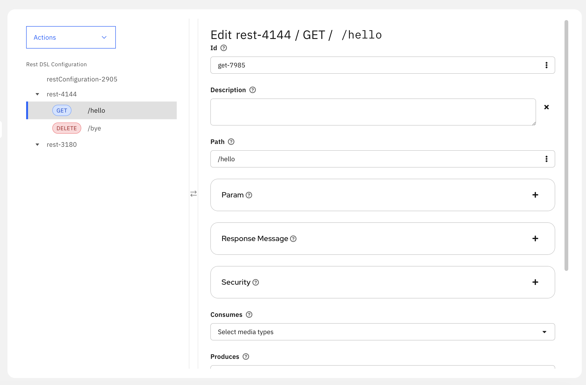
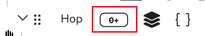
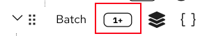
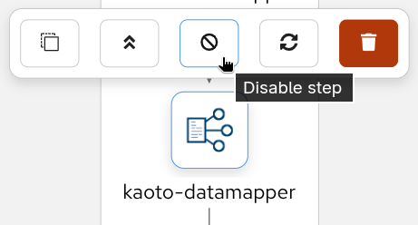
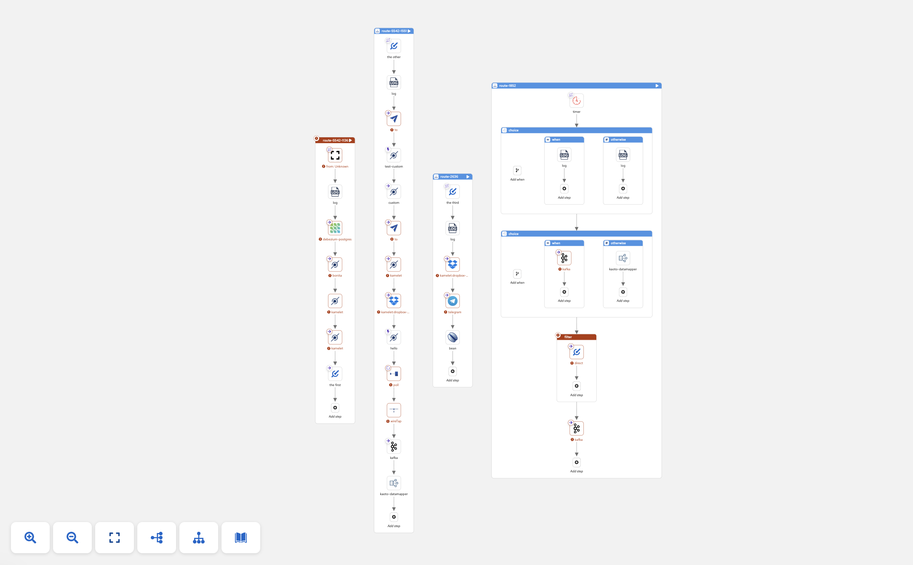
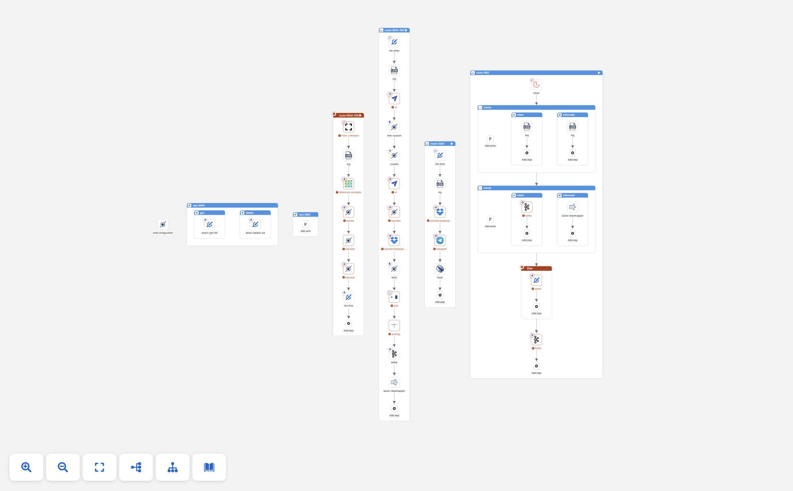
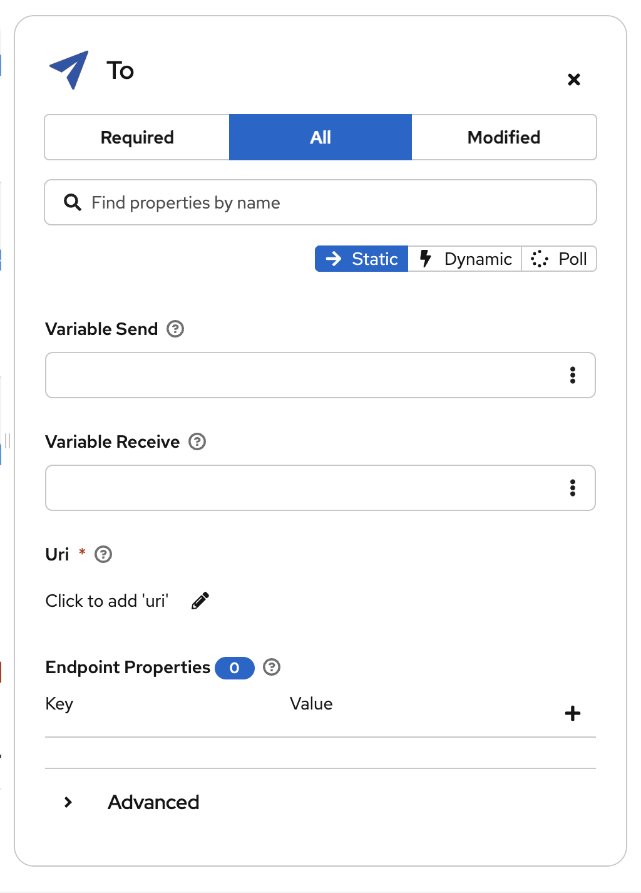

## What's New in Kaoto 2.10?

**Kaoto 2.10** represents a major leap forward in visual integration design, now powered by Apache Camel 4.18.0. This release bridges the gap between API-first design and integration development with full REST DSL and OpenAPI support, while significantly expanding DataMapper capabilities to handle complex multi-file schemas. Combined with production-ready drag-and-drop functionality, building sophisticated integrations has never been more intuitive.

## Here are the key highlights of this release:

### REST DSL Support with OpenAPI Integration

Kaoto 2.10 introduces comprehensive REST DSL support, enabling you to design and configure REST APIs visually within Apache Camel integrations:

- **OpenAPI Specification Import** - Import existing OpenAPI 3.0 specifications from multiple sources (file upload, remote URI, or Apicurio Registry) and automatically generate Camel REST DSL definitions with routes. Selectively choose which operations to import and create skeleton routes with `direct:` endpoints for each operation.

[Video once it is in vscode]

- **Visual REST Configuration** - Configure REST endpoints, operations, and bindings through Kaoto's intuitive tree-based interface. Define REST methods with parameters, security requirements, response messages, and content types while linking operations to Camel routes.

- **Settings Integration** - Manage REST DSL configuration through the Settings panel, including component selection (OpenAPI/Swagger), binding modes, API documentation generation, host configuration, and CORS settings.

[image once it is in vscode]

- **Smart Import Features** - Parse and validate OpenAPI specifications before import, preview all available operations with descriptions, detect existing routes to prevent duplicates, and choose to create REST definitions, routes, or both while preserving OpenAPI specification references.

This feature bridges the gap between API-first design and integration development, allowing you to leverage existing OpenAPI specifications directly in your Camel routes.

### DataMapper: Multiple Schema Support

The DataMapper has received substantial enhancements for handling complex data transformation scenarios:

**Multiple Schema Files**

Real-world data transformations often involve complex schemas split across multiple files. Kaoto 2.10 now handles these scenarios seamlessly:

- **XML Schema Imports** - Full support for `xs:import` and `xs:include`

- **Dependency Analysis** - Intelligent analysis of schema file dependencies

[datamapper-01-multiple-schema.mp4]

- **JSON Schema References** - Automatic resolution of JSON `$ref` references across multiple files

**Enhanced Data Source Support**

- **JSON Source Body** - Direct support for JSON source message body as a data source. In the previous version, the JSON source needed to be in a parameter.

[dm-02-json-body.mp4]

### DataMapper UI/UX Improvements

The DataMapper interface has been refined for better usability:

- **Expansion Panels** - Resizable, collapsible panels for better source data organization

[dm-03-expansion-panels.mp4]

- **Field Type Icons** - Visual indicators for field cardinality with Carbon Design System icons and dark mode support

 - “Opt” icon for optional field

 - “0+” icon for optional collection field

 - “1+” icon for required collection field

- **Zoom Controls** - Font size refinements and zoom controls for large schemas

[dm-05-zoom.mp4]

- **Disable DataMapper Step** - Option to temporarily disable DataMapper transformations

### Canvas and Visual Editor Enhancements

Building integrations is now more intuitive with these canvas improvements:

**Drag and Drop**

After extensive testing and refinement, drag and drop has graduated from experimental to **production-ready status**. This powerful feature is now enabled by default and fully supports complex integration patterns, making route construction faster and more intuitive than ever.

- **Edge Drop Support** - Drop components directly onto connection edges to insert them between nodes

- **Container Drag and Drop** - Move entire container components (like choice, doTry) with all their nested children

- **Visual Feedback** - Real-time visual indicators show valid drop targets with directional cues during drag operations

- **Insert-at-Start Capability** - Insert components at the beginning of containers using special placeholder nodes

- **Enabled by Default** - Drag and drop is automatically enabled for all movable nodes (excluding top-level routes and from endpoints)

[Video Drag-and-drop]

**Copy, Paste, and Context Menu**

- **Paste Entity** - Right-click context menu now includes paste functionality for quick entity duplication

- **Hide REST Flows** - Context menu option to hide REST DSL flows for cleaner canvas visualization

- **Smart Clipboard** - Clipboard access is now handled seamlessly without permission prompts on page load

**Layout and Rendering**

- **Canvas Layout Direction** - Choose between horizontal and vertical layout orientations to match your workflow preferences

- **Undo/Redo Improvements** - Nodes properly re-render after undo and redo operations, ensuring visual consistency

- **Create Routes from Direct** - Quickly create new routes starting from direct components with a single action

[direct01 and direct02]

### Forms and Configuration

Configuration forms have been enhanced for better usability:

- **Show/Hide URI** - Toggle URI visibility in component forms for a cleaner, more focused interface

- **Dynamic Toolbar Width** - Step toolbar automatically adjusts width based on visible buttons for optimal space usage

- **Improved VSCode Styling** - Enhanced visual integration with VSCode extension for a more cohesive development experience

### UI Components

New reusable components improve the overall experience:

- **Resizable Expansion Panels** - Flexible panel system with resize callbacks for customizable workspace layouts

- **Resizable Split Panels** - New component for creating resizable split views with adjustable proportions

- **Panel Behavior Fixes** - Resolved multiple issues with panel interactions

### Catalog Updates

- **Apache Camel 4.18** - Updated to the latest Camel catalog with new components and features

- **Citrus Framework Support** - Added Citrus catalog integration for testing scenarios

[add video with citrus here]

- **Camel Catalog v0.3.5** - Updated to latest @kaoto/camel-catalog version

### Notable Fixes

- **XML Bean Parsing** - Correctly parse beans in XML expression parser

- **YAML Entity Sorting** - Entities are now properly sorted when created, maintaining consistent ordering

- **URI Format Support** - Support for URI formats with and without `://` authority separator for flexible component configuration

- **DataMapper Element Resolution** - Fixed element reference resolution in various scenarios

- **Namespace Handling** - Distinguish elements with same local name but different namespaces

## Camel Catalog Version

Kaoto 2.10 includes support for:

- **Apache Camel 4.18.0** - Latest stable release

- **Camel Quarkus** - Compatible versions (3.32.0, 3.27.2)

- **Camel Spring Boot** - Compatible versions (4.18.0, 4.14.5)

## Get Started

Ready to try Kaoto 2.10? Here's how to get started:

- **Try it online**: Visit [kaoto.io](https://kaoto.io) to use Kaoto in your browser

- **VS Code Extension**: Install the [Kaoto extension](https://marketplace.visualstudio.com/items?itemName=redhat.vscode-kaoto) from the VS Code marketplace

- **Docker**: Run `docker run --rm -p 8080:8080 quay.io/kaotoio/kaoto-app:2.10.0`

- **Source Code**: Check out the [GitHub repository](https://github.com/KaotoIO/kaoto)

## Feedback Welcome

We'd love to hear your thoughts on Kaoto 2.10! Whether you're exploring REST DSL support, working with complex schemas in DataMapper, or enjoying the improved canvas experience, your feedback helps us make Kaoto better.

- **Report Issues**: [GitHub Issues](https://github.com/KaotoIO/kaoto/issues)

- **Join the Discussion**: [GitHub Discussions](https://github.com/KaotoIO/kaoto/discussions)

- **Community Chat**: Join us on [Zulip](https://camel.zulipchat.com/)

Special thanks to all contributors who made this release possible! This release includes over 100 pull requests from our amazing community.
